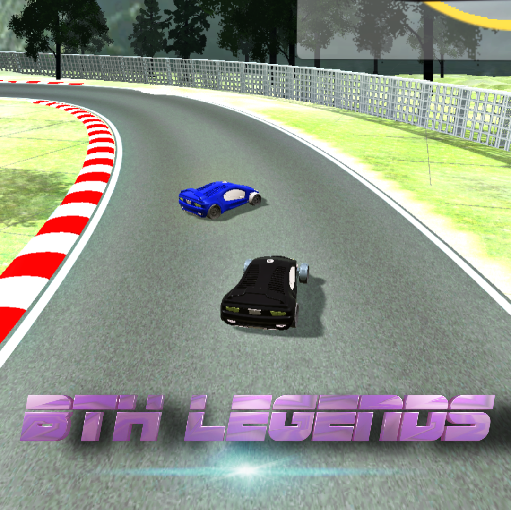

# __BTH Legends__

Beat the Heat- Legends is a single player car racing game where you have multiple modes and maps to race and with each race you earn coins
that you can use to buy exiting stuffs like car skins and maps in the game.

# 

# Race Modes

There are 3 modes (till update 1.0) in the game:

1. __Race Mode__ : Here you race with the computer AI, and earn $100 if you win and pay out $150 if you loose.
2. __Time Mode__ : Here you lap around the track competeting your own best time, if you break you best record $150 is awarded and $10 is deducted if you failed to do so.
3. __Practice Mode__ : To practice for the race and get familiar of the track without fear of loosing any cash.

# Playing Mannual

1. Coins eraned will be shown on home menu.
2. Below the name of every map high score of that map is shown, ("N/A" if none created yet) beating which will give you $150 unless you are playing in practice mode.
3. Car Movement using keys "AWSD", and camera mode using key "C".
4. Detailed description of playing guide can be seen in "How to Play" option in game.
